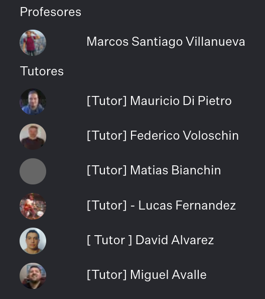
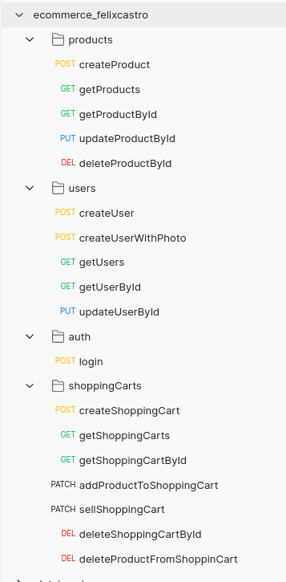
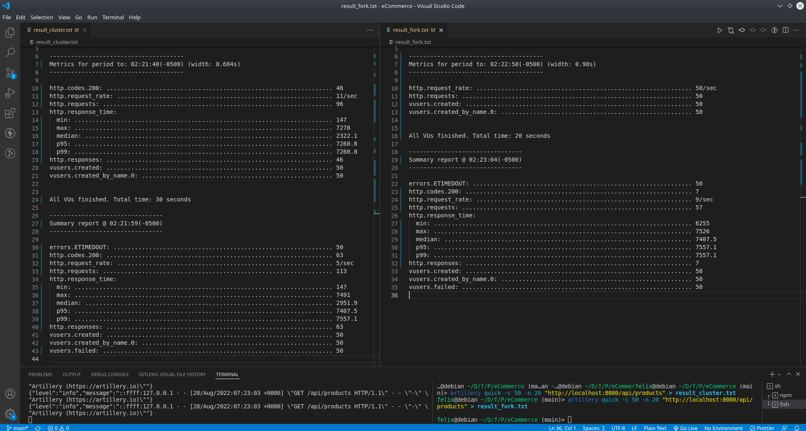

# 🚀 eCommerce backend v0.4.0

Proyecto final del curso de backend con nodejs en Coderhouse.

- **Comisión:** 30960
- **Profesor:** Marcos Villanueva
- **Comienza:** 04 abril 2022
- **Termina:** 14 septiembre 2022
- **Entrega del proyecto:** y revisión hasta la fecha aprox: 09/10/2022
- **Repo de desafíos:**
  En este [repositorio de desafíos](https://github.com/FelixGonzalo/curso_backend_30960) puedes acceder a todos los ejercicios del curso resueltos por mí.

- **Repo del profe:** En el [Repositorio del profe](https://github.com/marcosvillanueva9/backend-30960) van a poder acceder a todos los ejercicios de las clases

## ✌ Agradecimiento

---

Muchas gracias Marcos por las clases de buen nivel!

Muchas gracias a todos los tutores por el seguimiento y apoyo!

Éxitos!



## ⭐ Acerca del proyecto

---

Proyecto backend donde se implementa un API e-commerce para poder vender productos.

## 📝 Descripción

---

- API para manejar productos.
- API para manejar usuarios.
- API para manejar autenticación (login y uso de JWT)
- API para manejar carrito de compras
- Uso de servicios de gmail, WhatsApp y storage para imágenes.
  - gmail para confirmar registro de usuario y venta de carrito.
  - WhatsApp para confirmar venta de carrito.
  - storage para subir photo del usuario.
- MongoDB para persistir la data en producción y la opción de utilizar en memoria para desarrollo.
- Poder habilitar el modo CLUSTER mediante variable de entorno.
- Implementar registro de logs V1 con winston y morgan.
- Trabajar con dependencias typescript y ts-node-dev en vez de Webpack.
- Implementar el proyecto en TypeScript.
- Implementar el proyecto en capas.
  - routes: capa de rutas
  - controllers: capa de controladores
  - business: capa de negocio
  - persistence: capa de persistencia con implementación de repository, dto y dao.

## Prueba todas las opciones de la api

---

- API de prueba temporal en: https://ecommerce-felixcastro.herokuapp.com/api/products

  - Usuario admin para probar todos los endpoints sin restricciones:

  ```
  {
    "email": "felixcastro@demo.com",
    "password": "123456"
  }
  ```

- La documentación en Swagger está en proceso: api/docs

- Puedes importar el [archivo de endpoints](./ecommerce_felixcastro.postman_collection.json) para usarlo en Postman o Insomnia.



## 📦 Estructura de carpetas

---

```
├── build
├── logs
├── src
│   ├── business
│   ├── controllers
│   ├── middleware
│   │   ├── errors
│   │   ├── routes
│   │   ├── security
│   │   └── validators
│   ├── persistence
│   │   ├── dao
│   │   │   ├── productDao
│   │   │   ├── shoppingCartDao
│   │   │   └── userDao
│   │   ├── dto
│   │   └── repository
│   ├── routes
│   ├── services
│   │   ├── email
│   │   ├── storage
│   │   └── whatsapp
│   ├── store
│   │   ├── daos
│   │   ├── FileSystem
│   │   ├── firebase
│   │   ├── mongoDb
│   │   │   └── models
│   │   └── types
│   └── types
└── storage

```

EL contenido de la carpeta store será posteriormente movida y se eliminará la carpeta, ya que es parte de los entregables anteriores.

## 🛠️ Técnologias y recursos

---

- Node.js
- Express
- Typescript
- MongoDB
- Passport JWT
- Mongoose
- Bcrypt
- Dotenv
- Nodemailer
- Twilio
- (más detalle en el package.json)

## 👥 El equipo

---

El proyecto se trabaja de forma individual por [Felix Castro](https://www.linkedin.com/in/felix-castro-cubas-633037192)

## 🛠️ Available Scripts

---

### `npm run dev`

Corre el proyecto en modo desarrollo

### `npm run clean`

Elimina el build generado del proyecto

### `npm run build`

Construye el build del proyecto

### `npm run start`

Corre el build generado del proyecto en modo producción

## 🙌 Mis notas y feedback para seguir mejorando el proyecto

---

- Actualizar la documentación con swagger (Investigar como implementar la documentación por comentarios)
- Investigar como extender las propiedades del Request de Express con TypeScript para no usar req["newProperty"]
- Investigar estrategias de subida de archivos para que se cargue con previa validación de negocio. (Como alternativa eliminar el recurso si el registro fallo por validación de negocio)
- Mejorar la funcionalidad de vender el carrito de compras (Manejar cantidad por producto y actualización del stock)

<br>
<br>
<br>

# 📰 Historal de entregables anteriores

## PRIMERA ENTREGA: v0.1.0

Commit : https://github.com/FelixGonzalo/eCommerce_backend/tree/e069f7e7b1ec24ffd31297ec94e64b64dd8b8c69

### Descripción

- API para manejar productos
- API para manejar carrito de compras
- Persistencia en archivos.txt
- Documentación en /api/documentation

### Scripts

Para hacer build del proyecto. resultado en carpeta dist

` npm run build`

Para hacer build y resetear el servidor durante desarrollo

` npm run start`

### Consideraciones

Dentro de la carpeta dist generada al hacer build, debe agergar los archivos.txt donde se guardarán los datos: products.txt y shoppingCarts.txt

## SEGUNDA ENTREGA: v0.2.0

commit: https://github.com/FelixGonzalo/eCommerce_backend/tree/8dad489869438fa0556acef971ea5e571b2ad0bd

### Descripción

El proyecto puede usar File System, MongoDB o Firebase para la persistencia de los datos mediante el uso de DAOs.

- Para utilizar mongoDB o Firebase:

1. descomente la importación del archivo de conexión en el index.ts del proyecto

```
require('dotenv').config()

// import './store/mongoDb/connection' // connect to MongoDB
// import './store/firebase/connection' // connect to Firebase

import express from 'express'
// ...
```

2. dentro del index.ts en la carpeta daos cambie el DAO correspondiente.

```
import productDaoFileSystem from './productDaoFileSystem'
import shoppingCartDaoFileSystem from './shoppingCartDaoFileSystem'
// import productDaoMongoDB from './productDaoMongoDB'
// import shoppingCartDaoMongoDB from './shoppingCartDaoMongoDB'
// import productDaoFirebase from '../../store/daos/productDaoFirebase'

const productDao = productDaoFileSystem
const shoppingCartDao = shoppingCartDaoFileSystem
export { productDao, shoppingCartDao }

```

3. dentro del archivo .env del proyecto complete los datos necesarios tomando como ejemplo el .env.example

## TERCERA ENTREGA: v0.3.0

Commit: https://github.com/FelixGonzalo/eCommerce_backend/tree/dbd00e791e57eb0ea2ae97f27e0fac50718e19eb

**Descripción:**

- API para manejar autenticación (registro, login y uso de JWT)
- API para manejar carrito de compras actualizada (se agrega vender carrito)
- Uso de servicios de gmail, WhatsApp y storage para imágenes.
  - gmail para confirmar registro de usuario y venta de carrito.
  - WhatsApp para confirmar venta de carrito.
  - storage para subir photo del usuario.
- Ahora se utiliza solo MongoDB Atlas para persistir la data.
- Habilitar el modo CLUSTER mediante variable de entorno.
- Implementar registro de logs V1 con winston y morgan.
- Realizar prueba de performance en modo FORK y CLUSTER utilizando Artillery.
- Remover Webpack para trabajar con dependencias typescript y ts-node-dev
- Mejorar en el uso de TypeScript (tipado).
- Separar la declaración de rutas de los controladores en un archivo routes.ts

**Actualizacón de scripts:**

Para hacer build del proyecto. resultado en carpeta build

` npm run build`

Para limpiar el build generado

` npm run clean`

Para utilizar durante desarrollo

` npm run dev`

Para utilizar el build generado en producción

` npm run start`

**Captura de la prueba con Artillery**



**NOTAS: Pendientes adicionales a la entrega:**

- Actualizar la documentación con swagger (Investigar como implementar la documentación por comentarios)
- Investigar como extender las propiedades del Request de Express con TypeScript para no usar req["newProperty"]
- Investigar estrategias de subida de archivos para que se cargue con previa validación de negocio.
- Mejorar la funcionalidad de vender el carrito de compras (Manejar cantidad por producto y actualización del stock)
